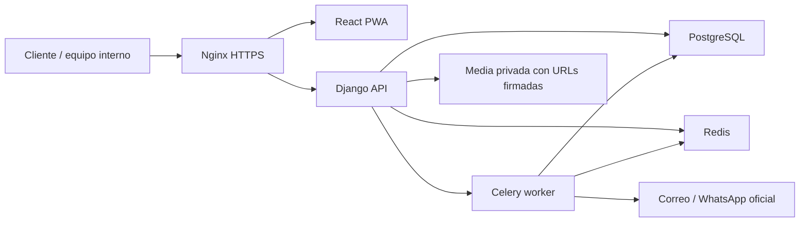
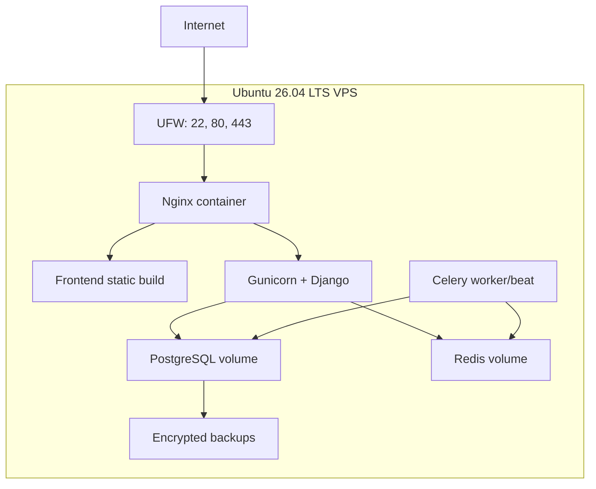
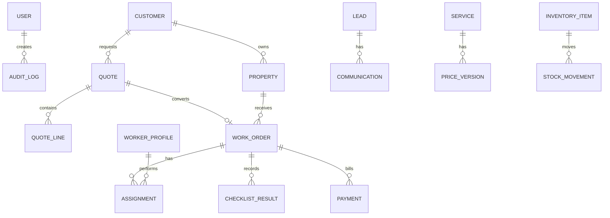

# Pacifica Cleaning: requisitos, alcance y arquitectura

## 1. Resumen de requisitos

Pacifica Cleaning necesita una plataforma bilingue para vender servicios, captar leads, recibir cotizaciones e inspecciones, y administrar la operacion diaria: CRM, propiedades, precios, cotizaciones, agenda, personal, calidad, finanzas, inventario, marketing, notificaciones y reportes.

La solucion debe operar en una VPS Linux pequena, con Docker, Nginx, PostgreSQL, Redis, tareas asincronas, CI/CD, seguridad por diseno, backups y documentacion operativa.

## 2. Preguntas y supuestos

- Supuesto: la empresa inicia en Tempate y zonas cercanas de Guanacaste; las zonas se configuran en base de datos.
- Supuesto: el sitio no debe afirmar personal asegurado, INS o CCSS hasta cargar documentos comprobables.
- Supuesto: WhatsApp se integrara mediante WhatsApp Cloud API oficial, no automatizaciones no autorizadas.
- Supuesto: facturacion electronica se tratara como integracion futura, no como contabilidad certificada.
- Pendiente: dominio final, proveedor de correo transaccional, proveedor autorizado de facturacion y politicas legales revisadas por abogado local.

## 3. Alcance MVP

- Sitio publico bilingue con servicios, zonas, FAQ, formularios, contacto, trabajos, politicas, SEO local, sitemap y robots.
- API segura con sesiones HTTP-only, CSRF, roles, auditoria y bloqueo temporal por intentos fallidos.
- Formulario publico de leads con serializer separado, honeypot, throttling y consentimiento obligatorio.
- CRM basico: leads, clientes, contactos, propiedades, comunicaciones y consentimientos.
- Catalogo de servicios, versionado de precios, cotizador y generacion de PDF.
- Agenda operativa con ordenes de servicio, asignaciones, estados, checklist y control de conflictos.
- Personal laboral y prestadores independientes separados.
- Calidad, finanzas operativas, inventario, marketing, notificaciones y KPIs iniciales.
- Docker Compose, Nginx, Celery, Redis, PostgreSQL, CI, backups y manuales.

## 4. Alcance fase 2

- Integracion real con WhatsApp Cloud API y plantillas aprobadas.
- Firma/aceptacion digital con trazabilidad legal.
- Rutas con mapas, calculo de traslado y evidencia geolocalizada.
- Portal de cliente para aprobar cotizaciones, revisar historial y pagar.
- Encuestas NPS automatizadas y analitica de cohortes.
- Exportaciones avanzadas a Excel/PDF y tablero financiero mensual.

## 5. Alcance futuro

- Facturacion electronica mediante proveedor autorizado o integracion oficial.
- App movil nativa si el PWA no cubre evidencia offline y geolocalizacion.
- Integracion con Meta Lead Ads y Google Ads con consentimiento granular.
- Optimizacion de asignacion por capacidad, distancia, habilidades y rentabilidad.

## 6. Arquitectura

Monolito modular con Django como propietario de reglas de negocio, datos, permisos, API, auditoria, reportes y tareas. React consume la API para el sitio publico y el portal administrativo. PostgreSQL almacena datos transaccionales; Redis se usa como broker/cache; Celery ejecuta tareas de correos, PDFs, recordatorios, backups y reportes.

## 7. Diagrama de componentes

## 8. Diagrama de despliegue

## 9. Modelo entidad-relacion

## 10. Lista de entidades y campos

Ver modelos Django en `backend/apps/*/models.py`. Entidades principales: usuario, auditoria, consentimiento, lead, cliente, contacto, propiedad, comunicacion, servicio, version de precio, cotizacion, linea de cotizacion, orden de servicio, asignacion, checklist, incidencia, revision de calidad, perfil de personal/prestador, pago, gasto, item de inventario, movimiento, campana, cupon, plantilla y bitacora de notificaciones.

## 11. Reglas de negocio

- Una cotizacion aceptada puede convertirse una sola vez en orden de servicio.
- La agenda bloquea solapes para la misma persona asignada.
- Las fotografias y documentos requieren consentimiento y se tratan como privados.
- Los datos de llaves, alarmas y accesos se enmascaran por defecto.
- Los descuentos requieren permiso de ventas o administracion.
- Prestadores independientes se gestionan con expediente separado y alerta de subordinacion si hay exclusividad, horario impuesto, supervision continua y herramientas obligatorias.
- El sistema financiero es operativo, no contabilidad certificada.

## 12. Roles y permisos

Roles iniciales: superadministrador, socio administrador, operaciones, ventas, finanzas, supervisor de calidad, personal operativo, prestador independiente y consulta/auditoria. La API aplica `IsAuthenticated` por defecto y permisos por rol en endpoints sensibles.

## 13. Historias de usuario

- Como cliente, quiero solicitar una cotizacion en espanol o ingles para recibir respuesta rapida.
- Como ventas, quiero convertir leads en clientes con propiedades y preferencias.
- Como operaciones, quiero ver agenda diaria y evitar conflictos de personal.
- Como supervisor, quiero revisar checklists, evidencias y reclamos.
- Como finanzas, quiero registrar pagos, gastos y margen por servicio.
- Como administrador, quiero auditar acciones sensibles y controlar permisos.

## 14. Criterios de aceptacion

- Formularios publicos validan en frontend y backend.
- Un usuario sin rol no accede a datos privados.
- Una asignacion solapada devuelve error de validacion.
- Una cotizacion calcula subtotal, impuestos, descuento y total.
- Una cotizacion no acepta descuentos negativos ni mayores al subtotal.
- Un usuario sin rol autorizado no ve instrucciones de acceso ni alarmas completas.
- Los PDF de cotizacion se generan desde datos persistidos.
- Los backups se pueden restaurar en un entorno limpio.

## 15. Diseno de API

Base `/api/v1/`. Recursos REST: `leads`, `customers`, `properties`, `services`, `price-versions`, `quotes`, `work-orders`, `workers`, `quality-reviews`, `payments`, `expenses`, `inventory-items`, `stock-movements`, `campaigns`, `notification-templates`. Autenticacion: `/api/auth/csrf/`, `/api/auth/login/`, `/api/auth/logout/`, `/api/auth/me/`, `/api/auth/mfa/verify/`.

## 16. Estructura del repositorio

El repositorio separa backend, frontend, infraestructura y documentacion para permitir CI independiente y despliegue conjunto en VPS.

## 17. Prototipo de navegacion

Publico: Inicio, Servicios, Como funciona, Zonas, FAQ, Blog, Contacto, Trabaje con nosotros, Politicas. Admin: Dashboard, CRM, Propiedades, Cotizaciones, Agenda, Personal, Calidad, Finanzas, Inventario, Marketing, Notificaciones, Reportes, Configuracion.

## 18. Sistema de diseno

Mobile-first, alto contraste, tipografia del sistema, botones de 44px minimo, estados claros, tablas densas en escritorio y tarjetas operativas en movil. Paleta: verde pacifico, azul profundo, coral de accion y grises calidos; se evita depender de un solo tono.

## 19. Plan de desarrollo por sprints

- Sprint 1: base tecnica, autenticacion, roles, sitio publico y formularios.
- Sprint 2: CRM, propiedades, servicios, cotizaciones y PDFs.
- Sprint 3: agenda, personal/prestadores, checklist y calidad.
- Sprint 4: finanzas, inventario, reportes, backups y endurecimiento.
- Sprint 5: integraciones reales, analitica con consentimiento y portal cliente.

## 20-24. Codigo, pruebas, Docker y CI/CD

Implementados en `backend/`, `frontend/`, `infra/` y `.github/workflows/ci.yml`.

## 25-29. Manuales

Ver `docs/02-manuales.md`.

## 30. Registro de decisiones tecnicas

Ver `docs/03-adr.md`.

## Pruebas por etapa

- Manuales: navegar sitio, enviar formulario, iniciar sesion, crear cliente, cotizar, agendar, registrar pago y revisar auditoria.
- Automaticas: Django `manage.py test`, frontend `npm run test`, build `npm run build`, CI con lint, tests, Bandit y pip-audit.
- Etapa seguridad API: pruebas agregadas para serializer publico de leads, enmascaramiento de accesos, validacion de agenda y reglas de cotizacion.
- Verificacion local realizada: compilacion de sintaxis Python con `python -m py_compile` sobre archivos tocados. Pruebas completas pendientes de Docker/CI porque la estacion no tiene `python`, `node`, `npm` ni `docker` en PATH.
